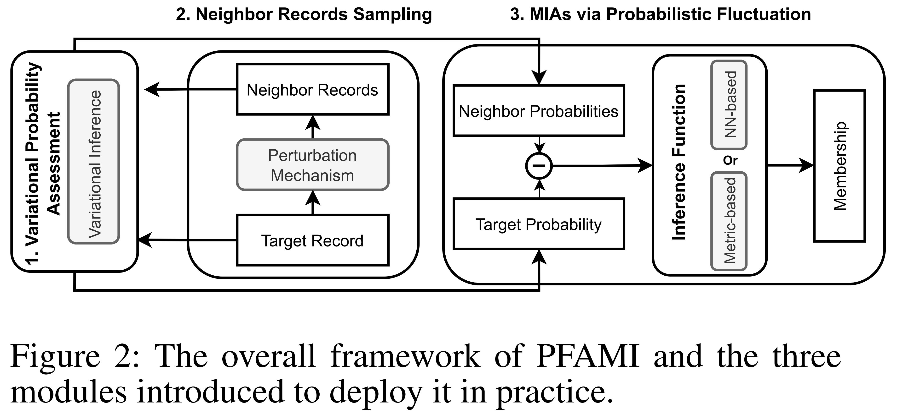

# Are overfitting-free generative models vulnerable to membership inference attack?

This is the official implementation of the paper "Are overfitting-free generative models vulnerable to membership inference attack?".
The proposed **P**robabilistic **F**luctuation **A**ssessing **M**embership **I**nference (PFAMI) is implemented as follows.



## Requirements

- torch>=1.11.0
- pythae>=0.1.1
- diffusers>=0.18.0
- accelerate==0.20.3
- datasets>=2.13.1
- torchvision=>0.12.0
- numpy>=1.23.4
- scikit-learn>=1.1.3
- pyyaml>=6.0
- tqdm>=4.64.1

Dependency can be installed with the following command:

```bash
pip install -r requirements.txt
```


## Target Models Training


* ### Diffusion Models
  
  All Diffusion models are built on top of [diffuser](https://huggingface.co/docs/diffusers/index), 
  on which you can train arbitrary state-of-the-art diffusion models you want. 
  So you can evaluate our attack algorithm on more diverse generative models, which is what we hope to see.
  We recommend to train diffusion models with multi-GPU and [accelerate](https://huggingface.co/docs/accelerate/index), 
  a library that enables the same PyTorch code to be run across any distributed configuration. 
  Below is a sample to train a DDPM on Celeba-64, and the training script for all other diffusion models can be found in the [path](./diffusion_models) folder:
  ```bash
    accelerate launch training_general.py \
    --train_data_dir="/mnt/data0/fuwenjie/MIA/MIA-Gen/target_model/data/celeba64/total" \
    --resume_from_checkpoint "latest" \
    --resolution=64 --center_crop \
    --output_dir="ddpm-celeba-64-50k" \
    --train_batch_size=16 \
    --num_epochs=400 \
    --checkpointing_steps=1500 \
    --gradient_accumulation_steps=1 \
    --learning_rate=1e-4 \
    --lr_warmup_steps=500 \
    --mixed_precision=no \
    --train_sta_idx=0 \
    --train_end_idx=50000 \
    --eval_sta_idx=50000 \
    --eval_end_idx=60000
  ```

* ### VAEs
  Similarly, all VAEs are deployed on by [pythae](https://huggingface.co/docs/diffusers/index), 
  on which you can train arbitrary state-of-the-art diffusion models you want. 
    ```json
      "env_args":
      {
        "train_ratio": 0.4,
        "sim_days": 40,
        "seq_num": 1,
        "unique_len": 16,
        "dataset": "Larger"
      },
    ```
## Pre-trained model
Pre-trained models can be downloaded from Hugging-face, we will release links after reviewing for anonymization.
  
## Run PFAMI

To execute SecMI over pretrained DDPM, please execute the following command:
```bash
tensorboard --logdir runs --host 0.0.0.0
```
The visualization results can be found in [http://localhost:6006](http://localhost:6006)